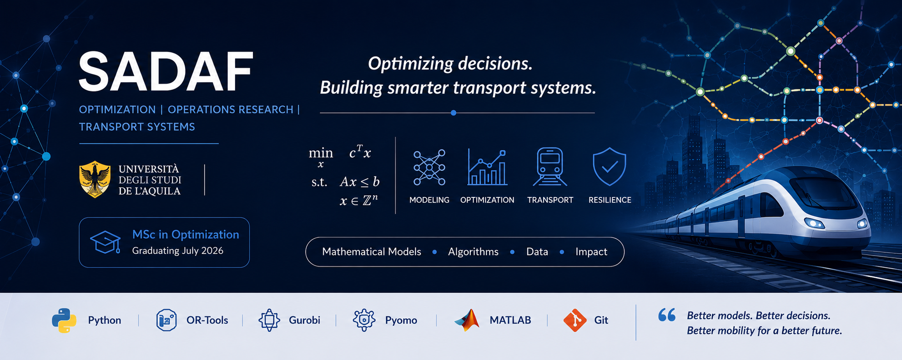

# Hi, I'm Sadaf 👋

🎓 MSc in Optimization and Mathematical Modelling  
🚆 Focused on Transport Systems and Operations Research  
📍 University of L'Aquila & University of Hamburg 

--

I am passionate about solving real-world industrial problems using:

- Mathematical Optimization
- Operations Research
- Scheduling
- Routing
- Python Programming

---

# Skills

## Languages
- Python
- Matlab

## Optimization Tools
- OR-Tools
- Gurobi
- Pyomo

## Areas
- Scheduling
- Routing
- Transport Optimization
- Mathematical Modelling

---

# 📂 Projects

##  Bus Bridging Optimization
Optimization model for railway disruption management using MILP.

##  Nurse Scheduling
Built a scheduling system using OR-Tools CP-SAT.

##  Transport Systems Analysis
Worked on optimization problems related to transportation systems.

---

#  GitHub Stats

---

#  Connect With Me

- Email: sadafmaqbool074@gmail.com

